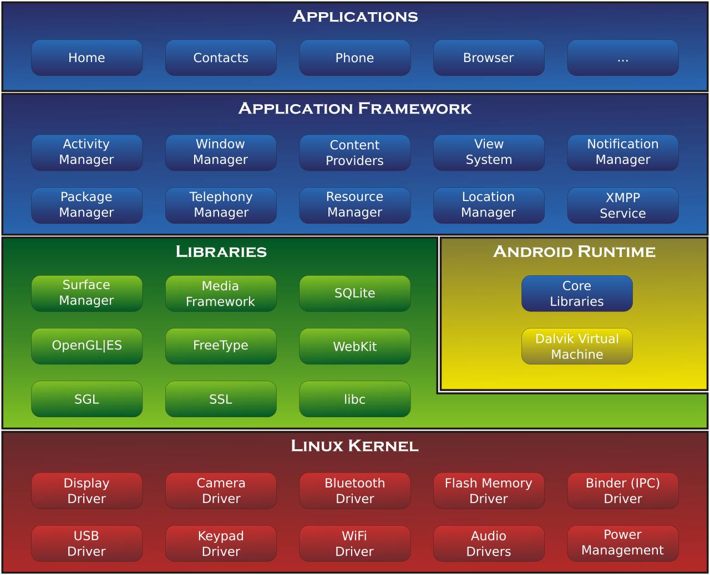
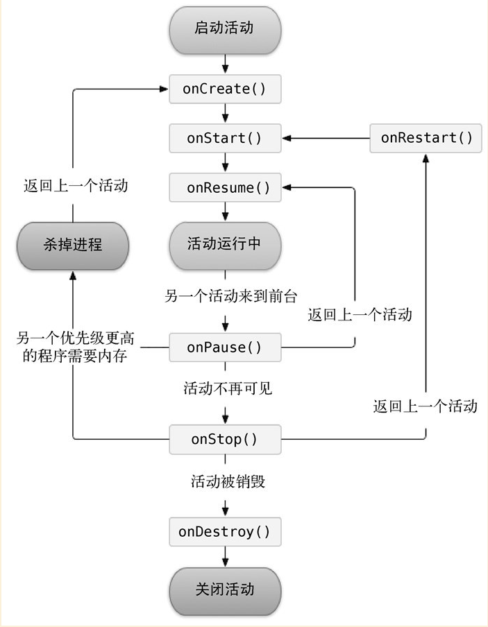
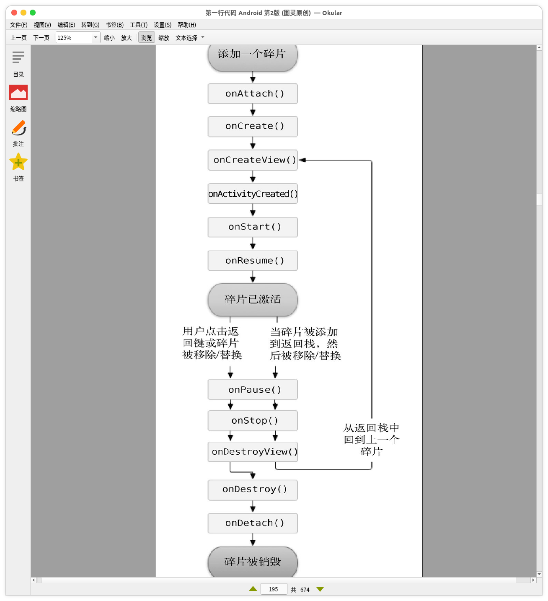
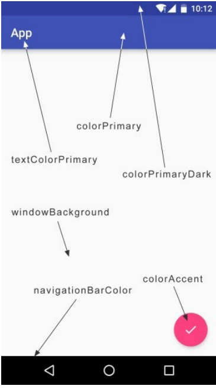
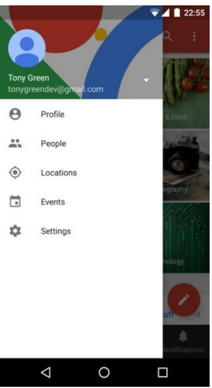
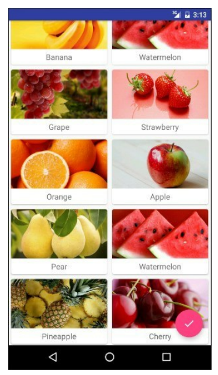

# 第一行代码-Android

*仅用于记录需要记忆的知识,一些很简单的常识直接略过*

## Android启程

一些介绍就不废话了。

### Android 系统架构

1. Linux 内核层

   主体是驱动部分

2. 系统运行库

   为Android提供支持的库，AndroidRuntime等

3. 应用架构

   Android Framework，系统提供的API

4. 应用层




### Android 应用开发特色

这些是应用开发主要接触的内容，大部分是需要精通的，少部分至少有些了解

1. 四大组建

   Activity 所看到的页面

   Service 后台运行的服务

   Broadcast 广播

   ContentProvider 内容提供者，为其他应用提供访问本应用数据的路径

2. 丰富的系统控件

   系统本身提供大量的API以供第三方应用使用

3. SQLite数据库

   轻量级数据库，适合移动端使用

4. 多媒体

   支持音视频照相等等，一个综合个人智能终端

5. 定位

   基于网络，gsm，gps定位，系统API比较笨拙且因为不可说的原因不好用，大部分时候是使用第三方的诸如高德百度等sdk


### 开发环境

直接去 [Android中国官网](https://developer.android.google.cn/) 下载AndroidStudio即可

​	*ps: baidu到的可能是第三方网站，建议bing或者google*

安装的时候无脑下一步就行

### 新建项目 启动应用

略

### 项目结构

基于Gradle，代码在app\src下面，java中是java代码，res中是布局图片等资源文件。

现在新建的Activity都基于`androidx.appcompat.app.AppCompatActivity`类

** 之前版本的Support包中的内容都存于各个版本诸如v4 v7等，新版本全部都整合到了androidx下，虽然之前的还能用，建议使用新api**


## Activity （活动）

*与用户交互的界面,绝大部分显示出来的都依托于activity*

### 创建

使用Android Studio的话直接new-> activity -> Empty Activity就可以了(快捷键alt+insert 然后输入activity)

自己创建的话,新建类extends Activity,然后在AndroidManifest.xml中注册:

```XML
<activity android:name=".chap09.HttpURLConnectionActivity" />
```

*ps: Android 四大组建都需要在AndroidManifest.xml中注册,否则会报错*

##### 布局

最快速且易用的编辑显示界面的方法

同样用Android Studio可以直接创建,选layout就行.

自己创建: 在res/layout目录中新建xml文件.在Activity的onCreate中调用`setContentView(R.layout.activity_http_u_r_l_connection);`就可以

##### 使用菜单（已经不是太常用了）

在`res/menu`中新建xml资源，Activity中重写：

```java
@Override
public boolean onCreateOptionsMenu(Menu menu) {
    getMenuInflater().inflate(R.menu.main, menu);
    return super.onCreateOptionsMenu(menu);
}
```

监听menu点击事件重写`public boolean onOptionsItemSelected( MenuItem item) {`

##### 启动制定Activity

显式： `startActivity(new Intent(Context,targetActivity.class));`

隐式：

```java
Intent intent = new Intent();
intent.setAction(targetAction);
// intent.addCategory(targetCategory); // 可选
startActivity(intent);
```

*action和category 均是Activity在AndroidManifest中注册时可增加的属性*

##### 一些常用的系统应用打开方式

使用隐式调用可以打开符合Intent的应用界面，下面是一些常用的：

```
new Intent().setData(Uri.parse("http://www.baidu.com")); // 用默认浏览器打开网页
new Intent().setData(Uri.parse("tel:10086")); // 拨号

```

Uri 也是配置在AndroidManifest中，属性如下：

> android: scheme。 用于 指定 数据 的 协议 部分， 如上 例 中的 http 部分。 android: host。 用于 指定 数据 的 主机 名 部分， 如上 例 中的 www. baidu. com 部分。 
>
> android: port。 用于 指定 数据 的 端口 部分， 一般 紧随 在 主机 名 之后。 android: path。 用于 指定 主 机名 和 端口 之后 的 部分， 如一 段 网址 中 跟在 域名 之后 的 内容。 
>
> android: mimeType。 用于 指定 可以 处理 的 数据 类型， 允许 使用 通配符 的 方式 进行 指定。

##### 传递数据：

`new Intent(target).putExtra(,)`目标可以用`getIntent().getxxxx`获取

##### 打开Activity并从中得到返回数据

如调用拍照等，可以在目标Activity拍完后拿到照片路径。

`startActivityForResult(Intent,requestCode)`并且重写`onActivityResult`可以在其中拿到返回的数据

### 生命周期

就是Activity在各个阶段会自动回调的方法。在其中添加我们自己的逻辑以便被调用。

Android是使用一个不可被应用访问的栈来管理。

##### 一个Activity会有四种状态

1. 运行态 可以被用户操作
2. 暂停状态 可见不可被操作。比如有弹窗时
3. 停止状态 完全不可见。这个状态不稳定，完全由系统决定何时被回收
4. 销毁 彻底被从栈中移除

##### 整个周期会被回调的方法

`onCreate` 被创建时调用，进行初始化操作，绑定布局等

`onStart` 变为可见时触发

`onResume` 可操作时触发

`onPause` 从可操作变为不可操作但可见时触发

`onStop` 不可见时触发

`onDestory` 被销毁时触发

`onRestart` 由停止重新运行时触发




##### 保存临时数据

处于onStop状态可能会被系统回收掉，如果重新返回这个页面，因为被回收会从新走onCreate，为了保存临时数据如EditText中的内容，可以重写`onSaveInstanceState(Bundle)`使用Bundle保存，在onCreate的bundle对象中读取。

##### Activity 启动模式

在AndroidManifest.xml中设置activity的launchMode属性，设置Activity被启动时的行为。

1. standard 默认，每次被打开都是在同一个栈中一个新的Activity
2. singleTop 当处于栈顶时不会重新创建，不处于栈顶打开新实例
3. singleTask 处于栈顶不会重新创建，处于栈中则弹出上面的Activity并显示已经存在的实例
4. singleTask *每个应用会有自己的栈* 设置了singleTask的Activity会有一个单独的栈。同一个应用打开的是相同的实例。*经验证，不同应用依旧打开不同实例*


## UI

Android UI由一个个控件组成。*大部分常用的略*

### 自定义控件

`<include>`标签只是引入布局，而使用自定义控件还可以复用事件相应。

如下自定义一个LinearLayout：

```
public class TitleLayout extends LinearLayout {
    public TitleLayout(Context context) {
        this(context,null);
    }

    public TitleLayout(Context context, AttributeSet attrs) {
        this(context, attrs,0);
    }

    public TitleLayout(Context context, AttributeSet attrs, int defStyleAttr) {
        super(context, attrs, defStyleAttr);
        LayoutInflater.from(context).inflate(R.layout.title, this);
    }
}
```

`R.layout.title`指向一个LinearLayout布局文件，引用的时候直接引用这个类替代`<include/>`

###### 需要补充自定义属性如何使用

### 列表

##### ListView

ListView 只是使用的话很简单，引入布局，定义Adapter，但是数据量多的时候会有加载的内容或者事件与对应位置index/position对应不上以及性能较差问题。使用ViewHolder来解决。

###### ViewHolder：

自定义Adapter，重写如下：

```Java

    @Override
    public View getView(int position, View convertView, ViewGroup parent) {
        Frui fruit = getItem(position);
        View view;
        ViewHolder viewHolder;
        if (convertView == null) {
            view = LayoutInflater.from(getContext()).inflate(resourceId, parent, false);
            viewHolder = new ViewHolder();
            viewHolder.fruitImage = (ImageView) view.findViewById(R.id.fruit_ image);
            viewHolder.fruitName = (TextView) view.findViewById(R.id.fruit_ name);
            view.setTag(viewHolder); // 将 ViewHolder 存储 在 View 中 
        } else {
            view = convertView;
            viewHolder = (ViewHolder) view.getTag(); // 重新 获取 ViewHolder

        } viewHolder.fruitImage.setImageResource(fruit.getImageId());
        viewHolder.fruitName.setText(fruit.getName());
        return view;
    }

    class ViewHolder {
        ImageView fruitImage;
        TextView fruitName;
    }
```

##### RecyclerView

更推荐使用RecyclerView来代替ListView，可配置性更高，并且默认使用ViewHolder，不用再自己考虑服复用问题。

1. 引入dependencies `androidx.recyclerview:recyclerview`

2. 引入布局

3. 自定义Adapter

   ```Java
   public class FruitAdapter extends RecyclerView.Adapter<FruitAdapter.ViewHolder> {
   
       private Context mContext;
       private List<Fruit> mFruitList;
   
       public FruitAdapter(List<Fruit> mFruitList) {
           this.mFruitList = mFruitList;
       }
   
       @NonNull
       @Override
       public ViewHolder onCreateViewHolder(@NonNull ViewGroup parent, int viewType) {
           if (mContext == null) mContext = parent.getContext();
           View view = LayoutInflater.from(mContext).inflate(R.layout.fruit_item,parent,false);
           final ViewHolder holder = new ViewHolder(view);
           holder.cardView.setOnClickListener(new View.OnClickListener() {
               @Override
               public void onClick(View v) {
                   int position = holder.getAdapterPosition();
                   Fruit fruit = mFruitList.get(position);
                   Intent intent = new Intent(mContext, FruitActivity.class);
                   intent.putExtra(FruitActivity.FRUIT_NAME, fruit.getName());
                   intent.putExtra(FruitActivity.FRUIT_IMAGE_ID, fruit.getImageId());
                   mContext.startActivity(intent);
               }
           });
           return holder;
       }
   
       @Override
       public void onBindViewHolder(@NonNull ViewHolder holder, int position) {
           Fruit fruit = mFruitList.get(position);
           holder.fruitName.setText(fruit.getName());
           Glide.with(mContext).load(fruit.getImageId()).into(holder.fruitImage);
       }
   
       @Override
       public int getItemCount() {
           return mFruitList.size();
       }
   
       public class ViewHolder extends RecyclerView.ViewHolder {
           CardView cardView;
           ImageView fruitImage;
           TextView fruitName;
           public ViewHolder(@NonNull View itemView) {
               super(itemView);
               cardView = (CardView) itemView;
               fruitImage = cardView.findViewById(R.id.fruit_image);
               fruitName = cardView.findViewById(R.id.fruit_name);
   
           }
       }
   }
   ```

4. 使用

   ```Java
   RecyclerView recyclerView = findViewById(R.id.recycler_view);
   GridLayoutManager layoutManager = new GridLayoutManager(this,3);
   recyclerView.setLayoutManager(layoutManager);
   adapter = new FruitAdapter(mFruitList);
   recyclerView.setAdapter(adapter);
   ```

   LayoutManager 常用有：
   
   * LinearLayoutManager 线性布局。类似默认的LinearLayout一条条添加，并且设置oritation可以实现横向列表
   * GridLayoutManager 网格布局，类似GridLayout
   * StaggeredGridLayoutManager 流式布局，类似GridLayoutManager只是每个条目高度不是固定的，而是适配条目本身大小。


## 碎片 Fragment

一开始是为了更容易适配平板,不过因为其灵活性,大部分应用都是把UI写在Fragment里面了.

### 使用方式

> (1) 创建待添加的碎片实例。
> (2) 获取FragmentManager,在活动中可以直接通过调用getSupportFragmentManager()方法
> 得到。
> (3) 开启一个事务,通过调用beginTransaction()方法开启。
> (4) 向容器内添加或替换碎片,一般使用replace()方法实现,需要传入容器的id和待添加
> 的碎片实例。
> (5) 提交事务,调用commit()方法来完成。

可以直接在布局中用<fragment android:name="target fragment class"/>

动态更换fragment:

```Java
private void replaceFragment(Fragment fragment) {
	FragmentManager fragmentManager = getSupportFragmentManager();
	FragmentTransaction transaction = fragmentManager.beginTransaction();
	transaction.replace(R.id.right_layout, fragment);
	transaction.commit();
}
```

*ps: 使用support包使代码适配范围更广,非support版本是从4.x开始的,不过现在影响不大,不过有的库是用的support使用时注意更改即可,其他support api同理*

### 用栈管理

```Java
private void replaceFragment(Fragment fragment) {
	FragmentManager fragmentManager = getSupportFragmentManager();
	FragmentTransaction transaction = fragmentManager.beginTransaction();
	transaction.replace(R.id.right_layout, fragment);
	transaction.addToBackStack(null);
	transaction.commit();
}
```

效果就是按back会先回退到上一个Fragment

### Fragment之间通信

```Java
RightFragment rightFragment = (RightFragment) getSupportFragmentManager()
.findFragmentById(R.id.right_fragment);
```

也可以用getActivity()获取Activity,然后用它中介

### 生命周期

1. 运行态 同Activity
2. 暂停态 同Activity,有弹窗时.
3. 停止态 
   * Activity处于停止态时
   * FragmentTransaction 调用remove,replce之前被addToBackStack,调用之后会停止,此时可能会被回收
4. 销毁
   * Activity被销毁
   * 没有被addToBackStack而被remove,replace




## Broadcast 广播

不同应用之间通信方式的一种.使用简单,效率一般.当系统中的任务太多,机器性能较差时可能会很晚才接到.

* 标准广播 发出来就不管了,不同应用接到的次序不定
* 有序广播 根据优先级依次接到,可以在高优先级的应用中拦截

### 接收

* 动态注册

  ```Java
  intentFilter = new IntentFilter();
  intentFilter.addAction("android.net.conn.CONNECTIVITY_CHANGE");
  networkChangeReceiver = new NetworkChangeReceiver();
  registerReceiver(networkChangeReceiver, intentFilter);
  
  
  class NetworkChangeReceiver extends BroadcastReceiver {
      @Override
      public void onReceive(Context context, Intent intent) {
      Toast.makeText(context, "network changes", Toast.LENGTH_SHORT).show();
      }
  }
  ```

  regist部分走完之后receiver才能接到

* 静态注册

  ```XML
  <receiver
      android:name=".BootCompleteReceiver"
      android:enabled="true"
      android:exported="true">
          <intent-filter>
          	<action android:name="android.intent.action.BOOT_COMPLETED" />
          </intent-filter>
  </receiver>
  
  ```

  然后类`extends BroadcastReceiver`即可.这样只要应用安装后启动过一次,就一直都能接到广播

  *ps1: 因为广播滥用,很多ODM长都对第三方应用广播进行了限制,这个可能接不到就不在这里讨论了*

  *ps2: 大部分时候是需要接收系统广播的,很多都需要相应权限,这个注意*

### 发送

* 标准广播`sendBroadcast(Context,Intent(TargetAction))`

* 有序广播`sendOrderedBroadcast()` receiver注册时增加`<intent-filter android:priority="100">`就可以决定接收顺序了,然后onReceive里面调用abortBroadcast可以中断广播不让后面的接收器接到


### 本地广播

仅本应用内部可以接发,其他应用接不到的广播.比全局广播效率要高一些,不过因为还是异步,尽量少用.

相较于全局广播,只是使用时调用下LocalBroadcastManager

```Java
// 获取manager
localBroadcastManager = LocalBroadcastManager.getInstance(Context); 
// 发送
localBroadcastManager.sendBroadcast(intent);
// 注册receiver
localBroadcastManager.registerReceiver(localReceiver, intentFilter);
```

**本地广播接收器无法静态注册**


## 持久化 数据存储

主要是文件存储,SharedPreference和数据库.

### 文件存储

可以储存简单的文本,二进制数据或者大文件.

通过Context.openFileOutput("name",MODE)来写入,获取文件流然后用Java的文件访问方式处理,Mode分为MODE_PRIVATE(默认方式,写入会覆盖源文件)和MODE_APPEND(如果源文件存在则会在后面追加)

通过Context.openFileInput("name")来读取

文件会默认保存在`/data/data/包名/files`中

### SharedPreference

主要用来存储配置信息,设置项等.

首先要获取SharedPreference对象:

1. `Context.getSharedPreference(name,mode)`新版本mode只能天MODE_PRIVATE了,文件会保存在`/data/data/packageName/shared_prefs`中
2. `Activity.getPreferences()`同Context
3. `PreferenceManager.getDefaultSharedPreference` 原版已经不再支持,新版使用androidx中的PreferenceManager

调用SharedPreference.edit() 获得Editor对象,调用Editor.putxxx()输入数据,Editor.apply将数据保存.SharedPreference.getXXX获取数据

*设置页面可以直接使用Preference相关API TODO:后续补充*

### SQLite数据库

SQLite是一个轻量级关系型数据库.速度快,占用低,还遵循ACID事务,符合移动端需求.

>  ACID: 指数据库事务正确执行的四个基本要素的缩写。包含：原子性（Atomicity）、一致性（Consistency）、隔离性（Isolation）、持久性（Durability）


##### 创建

使用`SQLiteOpenHelper`创建数据库.

```Java
public class MyDatabaseHelper extends SQLiteOpenHelper {
    public static final String SQL_CREATE_BOOK = "create table book(" +
            "id integer primary key autoincrement," +
            "author text," +
            "price real," +
            "pages integer," +
            "name text)";
    public static final String SQL_CREATE_CATEGORY = "create table Category (" +
            "id integer primary key autoincrement," +
            "category_name text," +
            "category_code integer)";
    private final Context mContext;

    public MyDatabaseHelper(@Nullable Context context, @Nullable String name, @Nullable SQLiteDatabase.CursorFactory factory, int version) {
        super(context, "BookStore.db", null, 1);
        mContext = context;
    }


    @Override
    public void onCreate(SQLiteDatabase db) {
        db.execSQL(SQL_CREATE_BOOK);
        db.execSQL(SQL_CREATE_CATEGORY);
    }

    @Override
    public void onUpgrade(SQLiteDatabase db, int oldVersion, int newVersion) {
        db.execSQL("drop table if exists Book");
        db.execSQL("drop table if exists Category");
        onCreate(db);
    }
}
```

会根据new时传入的version决定是否执行upgrade

> SQLite数据类型很简单,integer表示
> 整型,real表示浮点型,text表示文本类型,blob表示二进制类型。另外,上述建表语句
> 中我们还使用了primary key将id列设为主键,并用autoincrement关键字表示id列是自增
> 长的。

#### CRUD

数据库主要操作增删改查.Android均提供了默认API来支持,也支持直接执行SQL语句,所以均写两个版本的例子.

不过默认API除了不用估计SQL功底之外,还能使用批量操作提高性能.

##### Create - 增加

```Java
// Android API Version
SQLiteDatabase db = helper.getWritableDatabase();
ContentValues values = new ContentValues();
values.put("name","The Da Vinci Code");
values.put("author","Dan Drown");
values.put("pages",454);
values.put("price",16.13);
db.insert("Book", null, values);
values.clear();
values.put("name", "The Lost Symbo");
values.put("author","Dan Brown");
values.put("pages",510);
values.put("price",19.45);
db.insert("Book", null, values);

/// --> use sql version
db.execSQL("insert into Book(name,author,pages,price) values(?,?,?,?)"
           ,new String[]{"The Da Vinci Code 2","Dan Drown","454","16.13"});
db.close();
```

Research - 查找

查找是借助Cursor来遍历结果的

```Java
                SQLiteDatabase db = helper.getWritableDatabase();
                Cursor cursor = db.query("Book", null, null, null, null, null, null);
                // use sql version -->
                Cursor cursor1 = db.rawQuery("select * from Book",null);
                if (cursor.moveToFirst()) {
                    do {
                        String name = cursor.getString(cursor.getColumnIndex("name"));
                        String author = cursor.getString(cursor.getColumnIndex("author"));
                        int pages = cursor.getInt(cursor.getColumnIndex("pages"));
                        double price = cursor.getDouble(cursor.getColumnIndex("price"));
                        Log.d(TAG, "onClick: " + name + "," + author + "," + pages + "," + price);
                    } while (cursor.moveToNext());
                }
                cursor.close();
                db.close();
```


Update - 更新

```Java
                SQLiteDatabase db = helper.getWritableDatabase();
                ContentValues values = new ContentValues();
                values.put("price",10.99);
                db.update("Book",values,"name=?",new String[]{
                        "The Da Vinci Code"
                });
                /// use sql version -->
                db.execSQL("update Book set price=? where name=?"
                    ,new String[]{"10.99","The Da Vinci Code"});
                db.close();
```

Delete - 删除

```Java
                SQLiteDatabase db = helper.getWritableDatabase();
                db.delete("Book","pages > ?",new String[]{
                        "500"
                });
                /// use sql version -->
                db.execSQL("delete from Book where pages>?",new String[]{
                        "500"
                });
                db.close();
```

#### 使用LitePal

一款开源的ORM(对象关系映射)框架,极大的简化了数据库操作,建议使用并且阅读源码

> [https://github.com/guolindev/LitePal](https://github.com/guolindev/LitePal)


## ContentProvider 跨进程共享数据

在不同的应用间共享数据.

### 运行时权限

部分权限除了在AndroidManifest中申请以外,每次使用到都需要动态判断和申请.否则直接报错.

```Java
if (ContextCompat.checkSelfPermission(MainActivity.this, Manifest.
    permission.CALL_PHONE) != PackageManager.PERMISSION_GRANTED) {
        ActivityCompat.requestPermissions(MainActivity.this, new
        	String[]{ Manifest.permission.CALL_PHONE }, 1);
}

...
@Override
public void onRequestPermissionsResult(int requestCode, String[] permissions,
    int[] grantResults) {
        switch (requestCode) {
            case 1:
                if (grantResults.length > 0 && grantResults[0] == PackageManager.
                    PERMISSION_GRANTED) {
                    call();
                } else {
                    Toast.makeText(this, "You denied the permission", Toast.LENGTH_
                    	SHORT).show();
                }
            	break;
            default:
        }
}
```

### ContentResolver

访问其他应用的provider操作类似于数据库,也都是CRUD,只不过不再使用表名而是使用URI替代,然后由目标APP对URI处理.

```Java
	public void addBook(View view) {
        Uri uri = Uri.parse("content://com.lmoon.fileapp.provider/book");
        ContentValues values = new ContentValues();
        values.put("name","A Clash of Kings");
        values.put("author", "George Martin");
        values.put("pages",1030);
        values.put("price",22.64);
        Uri newUri = getContentResolver().insert(uri, values);
        newId = newUri.getPathSegments().get(1);
    }

    public void queryBook(View view) {
        Uri uri = Uri.parse("content://com.lmoon.fileapp.provider/book");
        Cursor cursor = getContentResolver().query(uri, null, null, null, null);
        if (cursor != null) {
            StringBuilder builder = new StringBuilder();
            while (cursor.moveToNext()) {
                builder.append(cursor.getString(cursor.getColumnIndex("name")));
            }
            Toast.makeText(this, builder.toString(), Toast.LENGTH_SHORT).show();
            cursor.close();
        } else {
            Toast.makeText(this, "No book", Toast.LENGTH_SHORT).show();
        }
    }

    public void updateBook(View view) {
        Uri uri = Uri.parse("content://com.lmoon.fileapp.provider/book/" + newId);
        ContentValues values = new ContentValues();
        values.put("name","A storm of Swords");
        values.put("pages",1216);
        values.put("price",24.15);
        int updatedRows = getContentResolver().update(uri, values, null, null);
        Toast.makeText(this, "Updated books: " + updatedRows, Toast.LENGTH_SHORT).show();
    }

    public void deleteBook(View view) {
        Uri uri = Uri.parse("content://com.lmoon.fileapp.provider/book");
        int deletedBooks = getContentResolver().delete(uri, null, null);
        Toast.makeText(this, "Deleted Books: " + deletedBooks, Toast.LENGTH_SHORT).show();
    }
```

联系人例子:

```Java
private void readContacts() {
Cursor cursor = null;
try {
// 查询联系人数据
cursor = getContentResolver().query(ContactsContract.CommonDataKinds.
Phone.CONTENT_URI, null, null, null, null);
if (cursor != null) {
while (cursor.moveToNext()) {
// 获取联系人姓名
String displayName = cursor.getString(cursor.getColumnIndex
(ContactsContract.CommonDataKinds.Phone.DISPLAY_NAME));
// 获取联系人手机号
String number = cursor.getString(cursor.getColumnIndex
(ContactsContract.CommonDataKinds.Phone.NUMBER));
contactsList.add(displayName + "\n" + number);
}
adapter.notifyDataSetChanged();
}
} catch (Exception e) {
e.printStackTrace();
} finally {
if (cursor != null) {
cursor.close();
}
}
}
```

### ContentProvider

```Java

public class MyProvider extends ContentProvider {

    public static final int TABLE1_DIR = 0;
    public static final int TABLE1_ITEM = 1;
    public static final int TABLE2_DIR = 2;
    public static final int TABLE2_ITEM = 3;
    public static final UriMatcher uriMatcher;
    static {
        uriMatcher = new UriMatcher(UriMatcher.NO_MATCH);
        uriMatcher.addURI("com.lmoon.providerapp.provider","table1",TABLE1_DIR);
        uriMatcher.addURI("com.lmoon.providerapp.provider","table1/#",TABLE1_ITEM);
        uriMatcher.addURI("com.lmoon.providerapp.provider","table2",TABLE2_DIR);
        uriMatcher.addURI("com.lmoon.providerapp.provider","table2/#",TABLE2_ITEM);
    }
    @Override
    public boolean onCreate() {
        // 。通常会在这里完成对数据库的创建和升级等操作,返回true表示内容提供器初始化成功,返回false则表示失败。
        return false;
    }

    @Nullable
    @Override
    public Cursor query(@NonNull Uri uri, @Nullable String[] projection, @Nullable String selection, @Nullable String[] selectionArgs, @Nullable String sortOrder) {
        SQLiteDatabase db = dbHelper.getWritableDatabase();
        switch (uriMatcher.match(uri)) {
            case TABLE1_DIR:
                cursor = db.query("Book", projection, selection, selectionArgs, null,
null, sortOrder);
                break;
            case TABLE1_ITEM:
                String bookId = uri.getPathSegments().get(1);
cursor = db.query("Book", projection, "id = ?", new String[] { bookId },
null, null, sortOrder);
                break;
            case TABLE2_DIR:
                cursor = db.query("Category", projection, selection, selectionArgs,
null, null, sortOrder);
                break;
            case TABLE2_ITEM:
                break;
        }
        return null;
    }

    @Nullable
    @Override
    public String getType(@NonNull Uri uri) {
        // 根据传入的内容URI来返回相应的MIME类型。
        switch (uriMatcher.match(uri)) {
            case TABLE1_DIR:
                return "vnd.android.cursor.dir/vnd.com.lmoon.providerapp.provider.table1";
            case TABLE1_ITEM:
                return "vnd.android.cursor.item/vnd.com.lmoon.providerapp.provider.table1";
            case TABLE2_DIR:
                return "vnd.android.cursor.dir/vnd.com.lmoon.providerapp.provider.table2";
            case TABLE2_ITEM:
                return "vnd.android.cursor.item/vnd.com.lmoon.providerapp.provider.table2";
        }
        return null;
    }

    @Nullable
    @Override
    public Uri insert(@NonNull Uri uri, @Nullable ContentValues values) {
        return null;
    }

    @Override
    public int delete(@NonNull Uri uri, @Nullable String selection, @Nullable String[] selectionArgs) {
        return 0;
    }

    @Override
    public int update(@NonNull Uri uri, @Nullable ContentValues values, @Nullable String selection, @Nullable String[] selectionArgs) {
        return 0;
    }
}
```

URI 主要两种方式:

`content://com.example.app.provider/table1`

`content://com.example.app.provider/table1/1` 后面的数字表示操作id

> 可以使用通配符的方式来分别匹配
> 这两种格式的内容URI,规则如下。
> *:表示匹配任意长度的任意字符。
> #:表示匹配任意长度的数字。
>
> 所以,一个能够匹配任意表的内容URI格式就可以写成:
> content://com.example.app.provider/*
> 而一个能够匹配table1表中任意一行数据的内容URI格式就可以写成:
> content://com.example.app.provider/table1/#

`getType`是必须实现的方法.用于判断URI对象对应的MIME类型 *问题就在于不知道这个有啥用啊*

规则如下:

* vnd 开头
* 如果URI以路径结尾则vnd后接`android.cursor.dir/`.如果以id结尾,则接`android.cursor.item/`
* 最后接`vnd.<authority>.<path>`

剩下的方法就直接访问数据库即可


## 多媒体

### 通知

新版本需要使用Channel来创建通知,通过channel会将相同类型的通知合并到多级通知里面,并且使用相同的配置,相同的管理.一个完整的使用channel的通知如下:

```Java
		NotificationManagerCompat manager = NotificationManagerCompat.from(this);
        // 通知渠道的id
        String id = "LearnNotification";
        // 用户可以看到的通知渠道的名字.
        CharSequence name = getString(R.string.channel_name);
        // 用户可以看到的通知渠道的描述
        String description = getString(R.string.channel_description);
        int importance = NotificationManager.IMPORTANCE_HIGH;
        NotificationChannel mChannel = new NotificationChannel(id, name, importance);
        // 配置通知渠道的属性
        mChannel.setDescription(description);
        // 设置通知出现时的闪灯（如果 android 设备支持的话）
        mChannel.enableLights(true);
        mChannel.setLightColor(Color.RED);
        // 设置通知出现时的震动（如果 android 设备支持的话）
        mChannel.enableVibration(true);
        mChannel.setVibrationPattern(new long[]{100, 200, 300, 400, 500, 400, 300, 200, 400});
        //最后在notificationmanager中创建该通知渠道
        //
        manager.createNotificationChannel(mChannel);

        Notification notification = new NotificationCompat.Builder(this, id)
                .setContentTitle("Content title")
//                .setContentText("This is a LongLongLongLongLongLongLongLongLongLongLongLongLongLongLongLongLongLongLongLongLongLongLong Text")
//                .setStyle(new NotificationCompat.BigTextStyle().bigText("This is a LongLongLongLongLongLongLongLongLongLongLongLongLongLongLongLongLongLongLongLongLongLongLong Text"))
                .setStyle(new NotificationCompat.BigPictureStyle().bigPicture(BitmapFactory.decodeResource(getResources(),R.drawable.a1)))
                .setPriority(NotificationCompat.PRIORITY_MIN)
                .setWhen(System.currentTimeMillis())
                .setSmallIcon(R.mipmap.ic_launcher)
                .setLargeIcon(BitmapFactory.decodeResource(getResources(),R.mipmap.ic_launcher)).build();

        manager.notify(1,notification);
```


### Camera

基本使用方法:

```Java
				File outputImage = new File(getExternalCacheDir(), "output_image.jpg");
                try {
                    if (outputImage.exists()) {
                        outputImage.delete();
                    }
                    outputImage.createNewFile();
                } catch (IOException e) {
                    e.printStackTrace();
                }
                if (Build.VERSION.SDK_INT >= 24) {
                    imageUri = FileProvider.getUriForFile(CameraAlbumActivity.this, "com.lmoon.firstcodeapp.fileprovider", outputImage);

                } else {
                    imageUri = Uri.fromFile(outputImage);
                }

                Intent intent = new Intent("android.media.action.IMAGE_CAPTURE");
                intent.putExtra(MediaStore.EXTRA_OUTPUT, imageUri);
                startActivityForResult(intent, REQUEST_TAKE_PHOTO);

// -----
@Override
protected void onActivityResult(int requestCode, int resultCode, @Nullable Intent data) {
        super.onActivityResult(requestCode, resultCode, data);
        switch (requestCode) {
            case REQUEST_TAKE_PHOTO:
                if (resultCode == RESULT_OK) {
                    try {
                        Bitmap bitmap = BitmapFactory.decodeStream(getContentResolver().openInputStream(imageUri));
                        picture.setImageBitmap(bitmap);
                    } catch (FileNotFoundException e) {
                        e.printStackTrace();
                    }
                }
                break;
```

android7.0之后访问文件需要使用FileProvider.以便将实际路径隐藏起来

##### FileProvider:

```Java
Uri imageUri = FileProvider.getUriForFile(CameraAlbumActivity.this, "com.lmoon.firstcodeapp.fileprovider", outputImage);
```

```XML
<!-- AndroidManifest.xml -->
<provider
            android:name="androidx.core.content.FileProvider"
            android:authorities="com.lmoon.firstcodeapp.fileprovider"
            android:exported="false"
            android:grantUriPermissions="true">
            <meta-data
                android:name="android.support.FILE_PROVIDER_PATHS"
                android:resource="@xml/file_paths" />
        </provider>
```

```XML
<!-- file_paths -->
<?xml version="1.0" encoding="utf-8"?>
<paths xmlns:android="http://schemas.android.com/apk/res/android">
    <external-cache-path
        name="my_images"
        path="" />
</paths>
```


### 相册中获取图片

首先需要判断EXTERNAL_STORAGE权限.然后依旧是startActivityForResult获取

```Java
    public void chooseFromAlbum(View view) {
        if (ContextCompat.checkSelfPermission(this, Manifest.permission.WRITE_EXTERNAL_STORAGE)
                != PackageManager.PERMISSION_GRANTED) {
            ActivityCompat.requestPermissions(this,new String[]{Manifest.permission.WRITE_EXTERNAL_STORAGE},1);
        } else {
            openAlbum();
        }
    }
    private void openAlbum() {
        Intent intent = new Intent("android.intent.action.GET_CONTENT");
        intent.setType("image/*");
        startActivityForResult(intent,REQUEST_CHOOSE_PHOTO);
    }

    @Override
    protected void onActivityResult(int requestCode, int resultCode, @Nullable Intent data) {
        switch (requestCode) {
            case REQUEST_CHOOSE_PHOTO:
                if (resultCode == RESULT_OK) {
                    handleImage(data);
                }
                break;
        }
}

    private void handleImage(Intent data) {
        String imagePath = null;
        Uri uri = data.getData();
        if (DocumentsContract.isDocumentUri(this, uri)) {
            String docId = DocumentsContract.getDocumentId(uri);
            if ("com.android.providers.media.documents".equals(uri.getAuthority())) {
                String id = docId.split(":")[1];
                String selection = MediaStore.Images.Media._ID + "=" + id;
                imagePath = getImagePath(MediaStore.Images.Media.EXTERNAL_CONTENT_URI, selection);
            } else if ("com.android.providers.downloads.documents".equals(uri.getAuthority())) {
                Uri conentUri = ContentUris.withAppendedId(Uri.parse("content://downloads/public_downloads"), Long.valueOf(docId));
                imagePath = getImagePath(conentUri, null);
            }
        } else if ("content".equalsIgnoreCase(uri.getScheme())) {
            imagePath = getImagePath(uri, null);
        } else if ("file".equalsIgnoreCase(uri.getScheme())) {
            imagePath = uri.getPath();
        }
        displayImage(imagePath);
    }
    private void displayImage(String imagePath) {
        if (TextUtils.isEmpty(imagePath)) {
            Toast.makeText(this, "Error path", Toast.LENGTH_SHORT).show();
        } else {
            Log.d(TAG, "displayImage: " + imagePath);
            Bitmap bitmap = BitmapFactory.decodeFile(imagePath);
            picture.setImageBitmap(bitmap);
        }
    }
    private String getImagePath(Uri externalContentUri, String selection) {
        String path = null;
        Cursor cursor = getContentResolver().query(externalContentUri, null, selection, null, null);
        if (cursor != null) {
            if (cursor.moveToNext()) {
                path = cursor.getString(cursor.getColumnIndex(MediaStore.Images.Media.DATA));
            }
            cursor.close();
        }
        Log.i(TAG, "getImagePath: " + path);
        return path;
    }
```

*Android Q 新增分区存储,会报错,需要更改AndroidManifest属性*

```XML

<manifest ... >
    <!-- This attribute is "false" by default on apps targeting Android Q. -->
    <application android:requestLegacyExternalStorage="true" ... >
     ...
    </application>
</manifest>

```


### 播放音频

> MediaPlayer的工作流程。首先需要创建出一
> 个MediaPlayer对象,然后调用setDataSource()方法来设置音频文件的路径,再调
> 用prepare()方法使MediaPlayer进入到准备状态,接下来调用start()方法就可以开始播放
> 音频,调用pause()方法就会暂停播放,调用reset()方法就会停止播放。

```Java
private void initMediaPlayer() {
    try {
        File file = new File(Environment.getExternalStorageDirectory(),
        "music.mp3");
        mediaPlayer.setDataSource(file.getPath()); // 指定音频文件的路径
        mediaPlayer.prepare(); // 让MediaPlayer进入到准备状态
    } catch (Exception e) {
    	e.printStackTrace();
    }
}

@Override
public void onClick(View v) {
    switch (v.getId()) {
        case R.id.play:
            if (!mediaPlayer.isPlaying()) {
            	mediaPlayer.start(); // 开始播放
            }
        break;
        case R.id.pause:
            if (mediaPlayer.isPlaying()) {
            	mediaPlayer.pause(); // 暂停播放
            }
        break;
        case R.id.stop:
            if (mediaPlayer.isPlaying()) {
                mediaPlayer.reset(); // 停止播放
                initMediaPlayer();
            }
        break;
        default:
        break;
    }
}
@Override
protected void onDestroy() {
    super.onDestroy();
    if (mediaPlayer != null) {
        mediaPlayer.stop();
        mediaPlayer.release();
    }
}
```

### 播放视频

使用VideoView

```XML
    <VideoView
        android:layout_width="match_parent"
        android:layout_height="wrap_content"
        android:id="@+id/video_view" />
```


```Java
    private void initVideoPath() {
        File file = new File(Environment.getExternalStorageDirectory(), "movie.mp4");
        Log.i(TAG, "initVideoPath: " + file.getPath());
        mVideoView.setVideoPath(file.getPath());
    }
    public void play(View view) {
        if (!mVideoView.isPlaying()) {
            mVideoView.start();
        }
    }

    public void pause(View view) {
        if (mVideoView.isPlaying()) {
            mVideoView.pause();
        }
    }

    public void replay(View view) {
        if (mVideoView.isPlaying()) {
            mVideoView.resume();
        } else {
            mVideoView.pause();
            mVideoView.resume();
        }
    }
    @Override
    protected void onDestroy() {
        super.onDestroy();
        if (mVideoView != null) {
            mVideoView.suspend();
        }
    }
```


## 网络

可以使用WebView提供简单的网页访问.

```XML
<WebView
    android:id="@+id/web_view"
    android:layout_width="match_parent"
    android:layout_height="match_parent"/>
```

注意权限

```XML
<uses-permission android:name="android.permission.INTERNET" />
```


### HTTP访问网络

非浏览器应用大部分时候是需要直接发HTTP请求获取服务器信息而不是直接把网页显示出来

因为种种原因,以前简单易用的HttpClient已经被移除了,android api访问的话直接使用HttpUrlConnection.

网络请求花费的时间一般比较长,所以需要放在子线程中使用.

```Java
    private void sendRequestWithHttpURLConnection() {
        new Thread(new Runnable() {
            @Override
            public void run() {
                HttpURLConnection connection = null;
                BufferedReader reader = null;
                try {
                    URL url = new URL("https://www.baidu.com");
                    connection = (HttpURLConnection) url.openConnection();
                    connection.setRequestMethod("GET");
                    connection.setConnectTimeout(8000);
                    connection.setReadTimeout(8000);
                    InputStream is = connection.getInputStream();
                    reader = new BufferedReader(new InputStreamReader(is));
                    StringBuilder builder = new StringBuilder();
                    String line;
                    while ((line = reader.readLine()) != null) {
                        Log.i(TAG, "run: " + line);
                        builder.append(line);
                    }
                    showResponse(builder.toString());
                } catch (MalformedURLException e) {
                    e.printStackTrace();
                } catch (IOException e) {
                    e.printStackTrace();
                }
            }
        }).start();
    }
```

如果需要post请求:

```Java
connection.setRequestMethod("POST");
DataOutputStream out = new DataOutputStream(connection.getOutputStream());
out.writeBytes("username=admin&password=123456");
```


> Android 9.0之后不能访问非加密连接。会报如下异常：
>
> CLEARTEXT communication to to 52.76.xx.xxx not permitted by network security policy
>
> 
>
> 解决：
>
> manifest.xml ->
>
> <application
>
> ...
>
> android:networkSecurityConfig="@xml/network_security_config"
>
> ...
>
> \>
>
> xml/network_security_config.xml
>
> <?xml version="1.0" encoding="utf-8"?>
>
> <network-security-config>
>
> ​    <base-config cleartextTrafficPermitted="true" />
>
> </network-security-config>

### OkHttp

网络非常复杂,想要获得优秀的网络体验需要考虑很多东西.

使用[OkHttp](https://github.com/square/okhttp) 这个开源框架可以大幅度削减自己要写的代码.

```
'com.squareup.okhttp3:okhttp:3.4.1'   // 引用
```

```Java
        new Thread(){
            @Override
            public void run() {
                try {
                    OkHttpClient client = new OkHttpClient();
                    Request request = new Request.Builder()
                            .url("https://www.baidu.com").build();
                    Response response = null;
                        response = client.newCall(request).execute();
                    String responseData = response.body().string();
                    showResponse(responseData);
                } catch (IOException e) {
                    e.printStackTrace();
                }

            }
        }.start();
```

### 解析XML

分为*Pull*和*SAX*两种方式

##### Pull

```Java
    private void parseXMLWithPull(String xmlData) {
        try {
            XmlPullParserFactory factory = XmlPullParserFactory.newInstance();
            XmlPullParser xmlPullParser = factory.newPullParser();
            xmlPullParser.setInput(new StringReader(xmlData));
            int eventType = xmlPullParser.getEventType();
            String id = "";
            String name = "";
            String version = "";
            while (eventType != XmlPullParser.END_DOCUMENT) {
                String nodeName = xmlPullParser.getName();
                switch (eventType) {
                    case XmlPullParser.START_TAG:
                        if ("id".equalsIgnoreCase(nodeName)) {
                            id = xmlPullParser.nextText();
                        } else if ("name".equalsIgnoreCase(nodeName)) {
                            name = xmlPullParser.nextText();
                        } else if ("version".equalsIgnoreCase(nodeName)) {
                            version = xmlPullParser.nextText();
                        }
                        break;
                    case XmlPullParser.END_TAG:
                        if ("app".equalsIgnoreCase(nodeName)) {
                            Log.i(TAG, "parseXMLWithPull: id -> " + id);
                            Log.i(TAG, "parseXMLWithPull: name -> " + name);
                            Log.i(TAG, "parseXMLWithPull: version -> " + version);
                        }
                        break;
                }
                eventType = xmlPullParser.next();
            }
        } catch (Exception e) {
            e.printStackTrace();
        }

    }
```

##### SAX

```Java

    private void parseXMLWithSAX(String responseData) {
        try {
            SAXParserFactory factory = SAXParserFactory.newInstance();
            XMLReader xmlReader = factory.newSAXParser().getXMLReader();
            MyHandler handler = new MyHandler();
            xmlReader.setContentHandler(handler);
            xmlReader.parse(new InputSource(new StringReader(responseData)));
        } catch (SAXException e) {
            e.printStackTrace();
        } catch (ParserConfigurationException e) {
            e.printStackTrace();
        } catch (IOException e) {
            e.printStackTrace();
        }
    }

public class MyHandler extends DefaultHandler {
    private String nodeName;
    private StringBuilder id;
    private StringBuilder name;
    private StringBuilder version;
    private String TAG = "lmoon";

    @Override
    public void startDocument() throws SAXException {
        super.startDocument();
        id = new StringBuilder();
        name = new StringBuilder();
        version = new StringBuilder();
    }

    @Override
    public void startElement(String uri, String localName, String qName, Attributes attributes) throws SAXException {
        super.startElement(uri, localName, qName, attributes);
        nodeName = localName;
    }

    @Override
    public void characters(char[] ch, int start, int length) throws SAXException {
        super.characters(ch, start, length);
        if ("id".equals(nodeName)) {
            id.append(ch, start, length);
        } else if ("name".equals(nodeName)) {
            name.append(ch, start, length);
        } else if ("version".equals(nodeName)) {
            version.append(ch, start, length);
        }
    }

    @Override
    public void endDocument() throws SAXException {
        super.endDocument();
    }

    @Override
    public void endElement(String uri, String localName, String qName) throws SAXException {
        super.endElement(uri, localName, qName);
        if ("app".equals(localName)) {
            Log.i(TAG, "id : " + id.toString().trim());
            Log.i(TAG, "name : " + name.toString().trim());
            Log.i(TAG, "version : " + version.toString().trim());
            id.setLength(0);
            name.setLength(0);
            version.setLength(0);
        }
    }

}
```


### 解析JSON

##### 默认API

```Java

    private void parseJSONWithJSONObject(String responseData) {
        try {
            JSONArray jsonArray = new JSONArray(responseData);
            for (int i = 0; i < jsonArray.length(); i++) {
                JSONObject jsonObject = jsonArray.getJSONObject(i);
                String id = jsonObject.getString("id");
                String name = jsonObject.getString("name");
                String version = jsonObject.getString("version");
                Log.i(TAG, "parseJSONWithJSONObject: id -> " + id);
                Log.i(TAG, "parseJSONWithJSONObject: name -> " + name);
                Log.i(TAG, "parseJSONWithJSONObject: version -> " + version);
            }
        } catch (JSONException e) {
            e.printStackTrace();
        }
    }
```

##### GSON

```gradle
implementation 'com.google.code.gson:gson:2.8.6'
```

```Java

    private void parseJSONWithGSON(String responseData) {
        Gson gson = new Gson();
        List<App> appList = gson.fromJson(responseData, new TypeToken<List<App>>() {
        }.getType()); // 为什么要加{}
        for (App app : appList) {
            Log.i(TAG, "parseJSONWithGSON: id -> " + app.getId());
            Log.i(TAG, "parseJSONWithGSON: name -> " + app.getName());
            Log.i(TAG, "parseJSONWithGSON: version -> " + app.getVersion());
        }

    }
```


## 服务

运行在后台的内容

注意服务中的代码一样运行在主线程中,所以耗时操作同样需要自己开子线程或者使用封装好的多线程服务.

##### 子线程中更新ui

只有主线程代码能与ui交互,子线程会报错.所以简单的可以使用`runOnUiThread(Runnalbe)`来控制ui,复杂的使用Handler

### Handler

```Java
private Handler handler = new Handler() {
    public void handleMessage(Message msg) {
        switch (msg.what) {
            case UPDATE_TEXT:
                // 在这里可以进行UI操作
                text.setText("Nice to meet you");
                break;
            default:
            	break;
        }
    }
};

new Thread(new Runnable() {
    @Override
    public void run() {
        Message message = new Message();
        message.what = UPDATE_TEXT;
        handler.sendMessage(message); // 将Message对象发送出去
    }
}).start();

```

Handler机制:由Message,Handler,MessageQueue,Looper四部分组成

* Message 消息的载体
* Handler 用来处理消息
* MessageQueue 消息队列,储存消息等待处理
* Looper 调用Looper.loop之后会无限循环,将MessageQueue中的消息依次发给Handler处理.

### AsyncTask

Android提供的子线程操作封装,方便写耗时操作.

```Java
public class DownloadTask extends AsyncTask<String, Integer, Integer> {

    public static final int TYPE_SUCCESS = 0;
    public static final int TYPE_FAILED = 1;
    public static final int TYPE_PAUSED = 2;
    public static final int TYPE_CANCELED = 3;

    private DownloadListener mDownloadListener;
    private boolean isCanceled = false;
    private boolean isPaused = false;
    private int progress;
    private String TAG = "lmoon.DownloadTask";

    public DownloadTask(DownloadListener listener) {
        mDownloadListener = listener;
    }
    @Override
    protected Integer doInBackground(String... params) {
        InputStream is = null;
        RandomAccessFile savedFile = null;
        File file = null;
        try {
            long downloadedLength = 0;
            String downloadUrl = params[0];
            String fileName = downloadUrl.substring(downloadUrl.lastIndexOf("/"));
            String directory = Environment.getExternalStoragePublicDirectory(Environment.DIRECTORY_DOWNLOADS).getPath();
            Log.i(TAG, "doInBackground: file path - " + directory);
            file = new File(directory + fileName);
            if (file.exists()) {
                downloadedLength = file.length();
            }
            long contentLength = getContentLength(downloadUrl);
            if (contentLength == 0) {
                Log.e(TAG, "doInBackground: Didn't find anything to download " + downloadUrl);
                return TYPE_FAILED;
            } else if (contentLength == downloadedLength) {
                Log.d(TAG, "doInBackground: File downloaded.");
                return TYPE_SUCCESS;
            }
            OkHttpClient client = new OkHttpClient();
            Request request = new Request.Builder()
                    .addHeader("RANGE", "bytes=" + downloadedLength + "-")
                    .url(downloadUrl)
                    .build();
            Response response = client.newCall(request).execute();
            if (response != null) {
                is = response.body().byteStream();
                savedFile = new RandomAccessFile(file, "rw");
                savedFile.seek(downloadedLength);
                byte[] b = new byte[1024];
                int total = 0;
                int len;
                while ((len = is.read(b)) != -1) {
                    if (isCanceled) {
                        return TYPE_CANCELED;
                    } else if (isPaused) {
                        return TYPE_PAUSED;
                    } else {
                        total += len;
                        savedFile.write(b);
                        int progress = (int) ((total + downloadedLength) * 100 / contentLength);
                        publishProgress(progress);
                    }
                }
                response.body().close();
                return TYPE_SUCCESS;
            }
        } catch (IOException e) {
            e.printStackTrace();
            return TYPE_FAILED;
        } finally {
            try {
                if (is != null) {
                    is.close();
                }
                if (savedFile != null) {
                    savedFile.close();
                }
                if (isCanceled && file != null) {
                    file.delete();
                }
            } catch (IOException e) {
                e.printStackTrace();
            }
        }
        return null;
    }

    private int lastProgress;
    @Override
    protected void onProgressUpdate(Integer... values) {
        super.onProgressUpdate(values);
        int progress = values[0];
        if (progress > lastProgress) {
            lastProgress = progress;
            mDownloadListener.onProgress(progress);
        }
    }

    @Override
    protected void onPostExecute(Integer status) {
        super.onPostExecute(status);
        switch (status) {
            case TYPE_SUCCESS:
                mDownloadListener.onSuccess();
                break;
            case TYPE_FAILED:
                mDownloadListener.onFailed();
                break;
            case TYPE_PAUSED:
                mDownloadListener.onPause();
                break;
            case TYPE_CANCELED:
                mDownloadListener.onCanceled();
                break;
            default:
                break;
        }
    }

    public void pauseDownload(){
        isPaused = true;
    }
    public void cancelDownload() {
        isCanceled = true;
    }

    private long getContentLength(String downloadUrl) throws IOException {
        OkHttpClient client = new OkHttpClient();
        Request request = new Request.Builder()
                .url(downloadUrl).build();
        Response response = client.newCall(request).execute();
        if (response != null && response.isSuccessful()) {
            long contentLength = response.body().contentLength();
            response.body().close();
            return contentLength;
        }
        return 0;
    }
}
```

`public class DownloadTask extends AsyncTask<String, Integer, Integer> {` 

三个范型参数,地一个表示传递给doInBackground的类型,第二个为进度单位,第三个是doInBackground返回结果类型,会传递到onPostExecute中.

主要有四个方法

* onPreExecute 子线程开始之前回调,用来进行一些ui初始化,如显示个对话框.不过也可以不用直接在调用task之前自己做.

* doInBackground 子线程

* onProgressUpdate 在doInBackground中调用publishProgress之后会回调这个方法,用来接收进度

* onPostExecute 子线程结束后回调,此方法已经处于主线程中并且可以接收doInbackground的返回结果.


### 基础的服务

##### 创建

AndroidStudio可以直接新建Service.

手动:

AndroidManifest 中注册`<service>`,然后类`extends Service`

##### 启动和停止

使用Intent来控制.

```Java
Intent intent = new Intent(this, DownloadService.class);
startService(intent);

...
stopService(intent);
```

在service内部可以直接调用stopSelf来停止自己.

周期: onCreate -> onStartCommand -> onDestoy

仅第一次创建时会走onCreate,已经启动了的service会直接走onStartCommand.

### 与服务通信

使用startService之后,服务和之前的代码就没有关系了.可以使用bindService来与服务通信,通信结束后unbind与服务断开链接.

服务自身重写onBind并返回binder对象,此时调用bind的地方通过传入的connecton中的onServiceConnected方法中可以拿到binder对象用来与服务通信.

```Java
	Intent intent = new Intent(this, DownloadService.class);
	startService(intent);
	bindService(intent, connection, BIND_AUTO_CREATE);

    @Override
    protected void onDestroy() {
        super.onDestroy();
        unbindService(connection);
    }

    private ServiceConnection connection = new ServiceConnection() {
        @Override
        public void onServiceConnected(ComponentName name, IBinder service) {
            mService = (DownloadService.DownloadBinder) service;
        }

        @Override
        public void onServiceDisconnected(ComponentName name) {

        }
    };
--- Service:

    @Override
    public IBinder onBind(Intent intent) {
        return mBinder;
    }
    private DownloadBinder mBinder = new DownloadBinder();
    class DownloadBinder extends Binder {
        ...
    }


```

*ps: bind和start没有什么关系,不过仅bind的话,unbind之后服务就会停止,而提前调用start,unbind之后服务还在运行.*

### 生命周期

> 一旦在项目的任何位置调用了Context的startService()方法,相应的服务就会启动起来,
> 并回调onStartCommand()方法。如果这个服务之前还没有创建过,onCreate()方法会先于
> onStartCommand()方法执行。服务启动了之后会一直保持运行状态,直到stopService()
> 或stopSelf()方法被调用。注意,虽然每调用一次startService()方
> 法,onStartCommand()就会执行一次,但实际上每个服务都只会存在一个实例。所以不管
> 你调用了多少次startService()方法,只需调用一次stopService()或stopSelf()方法,服
> 务就会停止下来了。
> 另外,还可以调用Context的bindService()来获取一个服务的持久连接,这时就会回调服
> 务中的onBind()方法。类似地,如果这个服务之前还没有创建过,onCreate()方法会先于
> onBind()方法执行。之后,调用方可以获取到onBind()方法里返回的IBinder对象的实
> 例,这样就能自由地和服务进行通信了。只要调用方和服务之间的连接没有断开,服务就
> 会一直保持运行状态。
> 当调用了startService()方法后,又去调用stopService()方法,这时服务中的
> onDestroy()方法就会执行,表示服务已经销毁了。类似地,当调用了bindService()方法
> 后,又去调用unbindService()方法,onDestroy()方法也会执行,这两种情况都很好理
> 解。但是需要注意,我们是完全有可能对一个服务既调用了startService()方法,又调用
> 了bindService()方法的,这种情况下该如何才能让服务销毁掉呢?根据Android系统的机
> 制,一个服务只要被启动或者被绑定了之后,就会一直处于运行状态,必须要让以上两种
> 条件同时不满足,服务才能被销毁。所以,这种情况下要同时调用stopService()和
> unbindService()方法,onDestroy()方法才会执行。

### 前台服务

后台服务可能被杀死,前台的话基本不会,但是会有个无法取消的通知.

```Java
startForeground(1,getNotification("Downloading ...",0));

---
    private Notification getNotification(String title, int progress) {
        Intent intent = new Intent(this, MainActivity.class);
        PendingIntent pendingIntent = PendingIntent.getActivity(this, 0, intent, 0);
        NotificationCompat.Builder builder = new NotificationCompat.Builder(this,getNotificationChannel())
                .setSmallIcon(R.mipmap.ic_launcher)
                .setContentIntent(pendingIntent)
                .setContentTitle(title);
        if (progress >= 0) {
            builder.setContentText(progress + "%");
            builder.setProgress(100, progress, false);
        }
        return builder.build();
    }

    private String getNotificationChannel() {
        NotificationManagerCompat manager = NotificationManagerCompat.from(this);
        // 通知渠道的id
        String id = "LearnNotification";
        // 用户可以看到的通知渠道的名字.
        CharSequence name = getString(R.string.channel_name);
        // 用户可以看到的通知渠道的描述
        String description = getString(R.string.channel_description);
        int importance = NotificationManager.IMPORTANCE_HIGH;
        NotificationChannel mChannel = new NotificationChannel(id, name, importance);
        // 配置通知渠道的属性
        mChannel.setDescription(description);
        // 设置通知出现时的闪灯（如果 android 设备支持的话）
        mChannel.enableLights(true);
        mChannel.setLightColor(Color.RED);
        // 设置通知出现时的震动（如果 android 设备支持的话）
        mChannel.enableVibration(true);
        mChannel.setVibrationPattern(new long[]{100, 200, 300, 400, 500, 400, 300, 200, 400});
        //最后在notificationmanager中创建该通知渠道
        //
        manager.createNotificationChannel(mChannel);
        return id;
    }
```

*注意使用Channel*

### IntentService

默认API提供的封装了子线程的服务

```Java

public class MyIntentSercie extends IntentService {
    /**
     * Creates an IntentService.  Invoked by your subclass's constructor.
     *
     * @param name Used to name the worker thread, important only for debugging.
     */
    public MyIntentSercie(String name) {
        super(name);
    }

    @Override
    protected void onHandleIntent(@Nullable Intent intent) {
        // your code
    }

    @Override
    public void onDestroy() {
        super.onDestroy();
    }
}
```

相比较于普通service,逻辑写在onHandleIntent中,此方法已经运行于子线程,所以可以执行耗时操作.并且当逻辑执行完不用手动stopservice/stopself,会自动停止运行并且回调onDestory.

## MaterialDesign

建议使用这个来设计界面,尤其是对个人来说.可以节省很大一部分精力一样能作出好看的ui.并且符合android设计ui规范.

另外,虽然例子是一个个介绍,不过实际用的时候很多是一起用的,而且相互之间有关联效果.

```Script
implementation 'com.android.support:design:28.0.0'
```

### ToolBar

ActionBar的替代.

首先需要指定一个不带ActionBar的主题.

```XML
<!-- styles.xml -->
    <!-- Base application theme. -->
    <style name="AppTheme" parent="Theme.AppCompat.Light.NoActionBar">
        <!-- Customize your theme here. -->
        <item name="colorPrimary">@color/colorPrimary</item>
        <item name="colorPrimaryDark">@color/colorPrimaryDark</item>
        <item name="colorAccent">@color/colorAccent</item>
    </style>
```

*各种属性对应位置*



引用ToolBar

```XML
<?xml version="1.0" encoding="utf-8"?>
<FrameLayout android:layout_width="match_parent"
    android:layout_height="match_parent"
    xmlns:android="http://schemas.android.com/apk/res/android"
    xmlns:app="http://schemas.android.com/apk/res-auto">

    <androidx.appcompat.widget.Toolbar
        android:layout_width="match_parent"
        android:layout_height="?attr/actionBarSize"
        android:id="@+id/tool_bar"
        android:background="?attr/colorPrimary"
        android:theme="@style/ThemeOverlay.AppCompat.Dark.ActionBar"
        app:popupTheme="@style/ThemeOverlay.AppCompat.Light"/>

</FrameLayout>
```

Activity中:

```Java
        Toolbar toolbar = findViewById(R.id.tool_bar);
        setSupportActionBar(toolbar);
```

activity对应的label属性能决定toolbar左边显示的名字.

### 滑动菜单 DrawerLayout

从侧面划出来的菜单.

Laytout:

```XML
<?xml version="1.0" encoding="utf-8"?>
<androidx.drawerlayout.widget.DrawerLayout xmlns:android="http://schemas.android.com/apk/res/android"
    xmlns:app="http://schemas.android.com/apk/res-auto"
    xmlns:tools="http://schemas.android.com/tools"
    android:layout_width="match_parent"
    android:layout_height="match_parent"
    android:id="@+id/drawer_layout"
    tools:context=".chap12.DrawerLayoutActivity">

    <FrameLayout
        android:layout_width="match_parent"
        android:layout_height="match_parent">

        <androidx.appcompat.widget.Toolbar
            android:layout_width="match_parent"
            android:layout_height="?attr/actionBarSize"
            android:background="@color/colorPrimary"
            android:theme="@style/ThemeOverlay.AppCompat.Dark.ActionBar"
            app:popupTheme="@style/ThemeOverlay.AppCompat.Light"
            android:id="@+id/tool_bar" />
    </FrameLayout>
    <TextView
        android:layout_width="match_parent"
        android:layout_height="match_parent"
        android:text="HHHHHHHHHHHHHHHHHH"
        android:layout_gravity="start"
        android:background="#fff"
        android:textSize="20sp" />

</androidx.drawerlayout.widget.DrawerLayout>
```

父布局直接使用DrawerLayout,而子布局有两个,第一个是主界面,第二个是滑动菜单.

在toolbar中显示一个按钮,点击之后直接显示滑动菜单

Activity:

```Java
		Toolbar toolbar = findViewById(R.id.tool_bar);
        setSupportActionBar(toolbar);

        mDrawerLayout = findViewById(R.id.drawer_layout);
        ActionBar actionBar = getSupportActionBar();
        if (actionBar != null) {
            actionBar.setDisplayHomeAsUpEnabled(true);
            actionBar.setHomeAsUpIndicator(R.drawable.ic_menu);
        }


---
        @Override
    public boolean onOptionsItemSelected(@NonNull MenuItem item) {
        Toast.makeText(this, "Menu clicked : " + item.getTitle(), Toast.LENGTH_SHORT).show();
        switch (item.getItemId()) {
            case android.R.id.home:
                mDrawerLayout.openDrawer(GravityCompat.START);
                break;
            default:
                break;
        }
        return true;
    }
```

*下面会使用到[circleview](https://github.com/hdodenhof/CircleImageView)这个第三方包 `implementation 'de.hdodenhof:circleimageview:3.1.0'`*

#### NavigationView



首先需要一个menu.xml

```XML
<?xml version="1.0" encoding="utf-8"?>
<menu xmlns:android="http://schemas.android.com/apk/res/android">
    <group android:checkableBehavior="single">
        <item
            android:id="@+id/nav_call"
            android:icon="@drawable/nav_call"
            android:title="Call" />
        <item
            android:id="@+id/nav_friends"
            android:icon="@drawable/nav_friends"
            android:title="Friends" />
        <item
            android:id="@+id/nav_location"
            android:icon="@drawable/nav_location"
            android:title="Location" />
        <item
            android:id="@+id/nav_mail"
            android:icon="@drawable/nav_mail"
            android:title="Call" />
        <item
            android:id="@+id/nav_task"
            android:icon="@drawable/nav_task"
            android:title="Tasks" />
    </group>
</menu>
```

然后是上面带图片的布局 headerLayout.

```XML
<?xml version="1.0" encoding="utf-8"?>
<RelativeLayout
    xmlns:android="http://schemas.android.com/apk/res/android" android:layout_width="match_parent"
    android:layout_height="180dp"
    android:padding="10dp"
    android:background="?attr/colorPrimary"
    >

    <de.hdodenhof.circleimageview.CircleImageView
        android:layout_width="70dp"
        android:layout_height="70dp"
        android:src="@drawable/a1"
        android:id="@+id/icon_image"
        android:layout_centerInParent="true" />

    <TextView
        android:layout_width="wrap_content"
        android:layout_height="wrap_content"
        android:id="@+id/mail"
        android:layout_alignParentBottom="true"
        android:textSize="14sp"
        android:text="@string/mail" />

    <TextView
        android:layout_width="wrap_content"
        android:layout_height="wrap_content"
        android:id="@+id/user_name"
        android:text="@string/user_name"
        android:textSize="14sp"
        android:layout_above="@id/mail" />

</RelativeLayout>
```

在DrawerLayout布局中第二个子布局使用NavigationView

```XML
    <com.google.android.material.navigation.NavigationView
        android:id="@+id/nav_view"
        android:layout_width="match_parent"
        android:layout_gravity="start"
        app:headerLayout="@layout/nav_header"
        app:menu="@menu/nav_menu"
        android:layout_height="match_parent" />
```

Activity中处理点击时间

```Java
        NavigationView navigationView = findViewById(R.id.nav_view);
        navigationView.setNavigationItemSelectedListener(new NavigationView.OnNavigationItemSelectedListener() {
            @Override
            public boolean onNavigationItemSelected(@NonNull MenuItem menuItem) {
                // 与menu处理方法一致,这里不再多写
                //mDrawerLayout.closeDrawer(GravityCompat.START);
                return true;
            }
        });
```

### 悬浮按钮 & 可交互提示

#### FloatingActionButton

```XML
        <com.google.android.material.floatingactionbutton.FloatingActionButton
            android:id="@+id/fab"
            android:layout_width="wrap_content"
            android:layout_height="wrap_content"
            android:layout_gravity="bottom|end"
            android:layout_margin="16dp"
            app:elevation="10dp"
            android:src="@drawable/ic_done" />
```

通过`app:elevation="10dp"`指定高度来控制阴影.值越大,范围大,效果淡.

通过setOnClickListener来处理点击事件

#### Snackbar

可以认为是带有点击事件的Toast.从底部弹出.可以与FloatingActionButton联动.

```Java
Snackbar.make(v, "Data deleted", Snackbar.LENGTH_SHORT)
                    .setAction("Undo", new View.OnClickListener() {
                        @Override
                        public void onClick(View v) {
                            Toast.makeText(FloatingActionButtonActivity.this, "Data restored", Toast.LENGTH_SHORT).show();
                        }
                    }).show();
```

#### CoordinatorLayout

上面使用Snackbar弹出之后会将actionbutton遮挡住,使用这个layout会自动处理,将button上移.

普通情况下等同于FrameLayout.

```XML

    <androidx.coordinatorlayout.widget.CoordinatorLayout
        android:layout_width="match_parent"
        android:layout_height="match_parent">
        <com.google.android.material.floatingactionbutton.FloatingActionButton
            android:id="@+id/fab"
            android:layout_width="wrap_content"
            android:layout_height="wrap_content"
            android:layout_gravity="bottom|end"
            android:layout_margin="16dp"
            app:elevation="10dp"
            android:src="@drawable/ic_done" />

    </androidx.coordinatorlayout.widget.CoordinatorLayout>
```

> 还记得我们在Snackbar的make()方法中传入的第一个参数吗?这个参数
> 就是用来指定Snackbar是基于哪个View来触发的,刚才我们传入的是FloatingActionButton
> 本身,而FloatingActionButton是CoordinatorLayout中的子控件,因此这个事件就理所应当
> 能被监听到了。你可以自己再做个试验,如果给Snackbar的make()方法传入一个
> DrawerLayout,那么Snackbar就会再次遮挡住悬浮按钮,因为DrawerLayout不是
> CoordinatorLayout的子控件,CoordinatorLayout也就无法监听到Snackbar的弹出和隐藏事
> 件了。

### 卡片布局




基于FrameLayout,只是提供了圆角和阴影.

*使用了第三方库[Glide](https://github.com/bumptech/glide) 用来加载图片*

```XML
<androidx.cardview.widget.CardView xmlns:android="http://schemas.android.com/apk/res/android"
    android:layout_width="match_parent"
    android:layout_height="wrap_content"
    xmlns:app="http://schemas.android.com/apk/res-auto"
    app:cardCornerRadius="4dp"
    android:layout_margin="5dp">

    <LinearLayout
        android:layout_width="match_parent"
        android:layout_height="wrap_content"
        android:orientation="vertical"
        >

        <ImageView
            android:layout_width="match_parent"
            android:layout_height="100dp"
            android:id="@+id/fruit_image"
            android:scaleType="centerCrop" />

        <TextView
            android:layout_width="wrap_content"
            android:layout_height="wrap_content"
            android:id="@+id/fruit_name"
            android:layout_gravity="center_horizontal"
            android:layout_margin="5dp"
            android:textSize="16sp" />
    </LinearLayout>

</androidx.cardview.widget.CardView>
```

#### AppBarLayout

CoordinatorLayout就是增强的FrameLayout,所以子布局可能会出现Toolbar被挡住的问题.使用Appbarlayout处理.

这是个垂直方向的LinerLayout.做了很多滚动事件封装.

```XML
    <androidx.coordinatorlayout.widget.CoordinatorLayout
        android:layout_width="match_parent"
        android:layout_height="match_parent">

        <com.google.android.material.appbar.AppBarLayout
            android:layout_width="match_parent"
            android:layout_height="wrap_content">

            <androidx.appcompat.widget.Toolbar
                android:id="@+id/tool_bar"
                android:layout_width="match_parent"
                android:layout_height="?attr/actionBarSize"
                android:background="@color/colorPrimary"
                android:theme="@style/ThemeOverlay.AppCompat.Dark.ActionBar"
                app:layout_scrollFlags="scroll|enterAlways|snap"
                app:popupTheme="@style/ThemeOverlay.AppCompat.Light" />
        </com.google.android.material.appbar.AppBarLayout>
        <android.support.v7.widget.RecyclerView
            android:id="@+id/recycler_view"
            android:layout_width="match_parent"
            android:layout_height="match_parent"
            app:layout_behavior="@string/appbar_scrolling_view_behavior" />
        ...
	</androidx.coordinatorlayout.widget.CoordinatorLayout>
```

这时Toolbar就已经不会被挡住了.

并且recyclerview的滚动事件会传递给appbarlayout.将appbarlayout设置`app:layout_scrollFlags="scroll|enterAlways|snap"`可以决定在recyclerview滚动时toolbar的行为.

* scroll recyclerview向上滚动,toolbar会跟随上滚并隐藏
* enterAlways recyclerview向下滚动,toolbar会跟随显示
* snap toolbar没有完全隐藏或者显示则根据当前滚动距离自动决定隐藏还是显示

### 下拉刷新 SwipeRefreshLayout

```XML
<androidx.swiperefreshlayout.widget.SwipeRefreshLayout
            android:layout_width="match_parent"
            android:layout_height="match_parent"
            android:id="@+id/swipe_refresh"
            app:layout_behavior="@string/appbar_scrolling_view_behavior">

            <androidx.recyclerview.widget.RecyclerView
                android:id="@+id/recycler_view"
                android:layout_width="match_parent"
                android:layout_height="match_parent" />
</androidx.swiperefreshlayout.widget.SwipeRefreshLayout>
```

```Java
swipeRefreshLayout = findViewById(R.id.swipe_refresh);
        swipeRefreshLayout.setColorSchemeResources(R.color.colorPrimary);
        swipeRefreshLayout.setOnRefreshListener(new SwipeRefreshLayout.OnRefreshListener() {
            @Override
            public void onRefresh() {
                refreshFruits();
            }
        });
```

### 可折叠标题栏

#### CollapsingToolbarLayout

不能单独使用,必须作为AppBarLayout子布局,AppBarLayout又必须是CoordinatorLayout子布局.

```XML
<?xml version="1.0" encoding="utf-8"?>
<androidx.coordinatorlayout.widget.CoordinatorLayout xmlns:android="http://schemas.android.com/apk/res/android"
    xmlns:app="http://schemas.android.com/apk/res-auto"
    xmlns:tools="http://schemas.android.com/tools"
    android:layout_width="match_parent"
    android:fitsSystemWindows="true"
    android:layout_height="match_parent"
    tools:context=".chap12.FruitActivity">

    <com.google.android.material.appbar.AppBarLayout
        android:id="@+id/appBar"
        android:layout_width="match_parent"
        android:layout_height="250dp"
        android:fitsSystemWindows="true"
        >

        <com.google.android.material.appbar.CollapsingToolbarLayout
            android:layout_width="match_parent"
            android:layout_height="match_parent"
            android:theme="@style/ThemeOverlay.AppCompat.Dark.ActionBar"
            app:contentScrim="?attr/colorPrimary"
            app:layout_scrollFlags="scroll|exitUntilCollapsed"
            android:fitsSystemWindows="true"
            android:id="@+id/collapsing_toolbar" >

            <ImageView
                android:layout_width="match_parent"
                android:layout_height="match_parent"
                android:id="@+id/fruit_image_view"
                android:scaleType="centerCrop"
                app:layout_collapseMode="parallax"
                android:fitsSystemWindows="true"/>

            <androidx.appcompat.widget.Toolbar
                android:layout_width="match_parent"
                android:layout_height="?attr/colorPrimary"
                android:id="@+id/tool_bar"
                app:layout_collapseMode="pin" />
        </com.google.android.material.appbar.CollapsingToolbarLayout>
    </com.google.android.material.appbar.AppBarLayout>

    <androidx.core.widget.NestedScrollView
        android:layout_width="match_parent"
        app:layout_behavior="@string/appbar_scrolling_view_behavior"
        android:layout_height="match_parent" >
        <LinearLayout
            android:layout_width="match_parent"
            android:orientation="vertical"
            android:layout_height="wrap_content">
            <androidx.cardview.widget.CardView
                android:layout_width="match_parent"
                android:layout_height="wrap_content"
                android:layout_marginTop="35dp"
                android:layout_marginHorizontal="15dp"
                android:layout_marginBottom="15dp"
                app:cardCornerRadius="4dp"
                >

                <TextView
                    android:layout_width="wrap_content"
                    android:layout_height="wrap_content"
                    android:id="@+id/fruit_content_text"
                    android:layout_margin="10dp" />
            </androidx.cardview.widget.CardView>
        </LinearLayout>
    </androidx.core.widget.NestedScrollView>

    <com.google.android.material.floatingactionbutton.FloatingActionButton
        android:layout_width="wrap_content"
        android:layout_height="wrap_content"
        android:layout_margin="16dp"
        android:src="@drawable/ic_comment"
        app:layout_anchor="@id/appBar"
        app:layout_anchorGravity="bottom|end" />
</androidx.coordinatorlayout.widget.CoordinatorLayout>
```

` app:layout_scrollFlags="scroll|exitUntilCollapsed"` : scroll表示CollapsingToolbarLayout会随着水果内容详情的滚动一起滚动,exitUntilCollapsed表示当CollapsingToolbarLayout随着滚动完成折叠之后就保留在界面上,不再移出屏幕。

`app:layout_collapseMode="pin" ` : 表示在折叠的过程中位置始终保持不变

`app:layout_collapseMode="parallax"` : 表示会在折叠的过程中产生一定的错位偏移

#### 使用statusbar空间 `android:fitsSystemWindow`

需要将想要显示到statusbar位置的控件及其父布局全部设置这个属性

## 其他技巧

### Intent传递对象

##### `implements Serializable`

Java本身的序列化机制,Intent可以传递Serial对象.

##### `implements Parcelable`

Android自身的方式,将一个完整的对象分解.分解成Intent本身支持的数据类型.

```Java
public class Person implements Parcelable {
    private String name;
    private int age;
    @Override
    public int describeContents() {
        return 0;
    }

    @Override
    public void writeToParcel(Parcel dest, int flags) {
        dest.writeString(name);
        dest.writeInt(age);
    }

    public static final Parcelable.Creator<Person> CREATOR = new Creator<Person>() {
        @Override
        public Person createFromParcel(Parcel source) {
            Person person = new Person();
            person.name = source.readString();
            person.age = source.readInt();
            return person;
        }

        @Override
        public Person[] newArray(int size) {
            return new Person[size];
        }
    };
}
```

`describeContents` return 0即可

`writeToParcel` 调用dest的write方法.将成员变量都写进去.

`public static final Parcelable.Creator<Person> CREATOR` 必须要有的CREATOR newArray很简单.createFromeParcel创建本对象并逐个read,并且,此时的顺序需要和writeToParcel一致.


### 定时任务

##### Alarm

```java
AlarmManager manager = (AlarmManager) getSystemService(Context.ALARM_SERVICE);
long triggerAtTime = SystemClock.elapsedRealtime() + 10 * 1000;
manager.set(AlarmManager.ELAPSED_REALTIME_WAKEUP, triggerAtTime, pendingIntent);
```

> 第一个参数是一个整型参数,用于指定AlarmManager
> 的工作类型,有4种值可选,分别是ELAPSED_REALTIME、ELAPSED_REALTIME_WAKEUP、RTC和
> RTC_WAKEUP。其中ELAPSED_REALTIME表示让定时任务的触发时间从系统开机开始算起,但
> 不会唤醒CPU。ELAPSED_REALTIME_WAKEUP同样表示让定时任务的触发时间从系统开机开始
> 算起,但会唤醒CPU。RTC表示让定时任务的触发时间从1970年1月1日0点开始算起,但不
> 会唤醒CPU。RTC_WAKEUP同样表示让定时任务的触发时间从1970年1月1日0点开始算起,
> 但会唤醒CPU。使用SystemClock.elapsedRealtime()方法可以获取到系统开机至今所经历
> 时间的毫秒数,使用System.currentTimeMillis()方法可以获取到1970年1月1日0点至今所
> 经历时间的毫秒数。

不过随着Android发展,对后台的限制越来越大,这种方式可能不准确

##### Doze 系统的后台控制

##### 多窗口模式

可以同时打开两个窗口,不过并不常用.

生命周期: 进入多窗口状态会重新从onCreate走一遍.同时打开两个窗口后如果切换到另一个窗口,则本应用会进入onpause,返回就onresume.

可以在activity加入下列属性

```XML
<activity
android:name=".MainActivity"
android:label="Fruits"
android:configChanges="orientation|keyboardHidden|screenSize|screenLayout">
```

加入了这行配置之后,不管是进入多窗口模式,还是横竖屏切换,活动都不会被重新创建,而是会将屏幕发生变化的事件通知到Activity的onConfigurationChanged()方法当中

`android:resizeableActivity=["true" | "false"]` 可以选择禁用多窗口

##### Lambda

build.gradle

```Script
compileOptions {
sourceCompatibility JavaVersion.VERSION_1_8
targetCompatibility JavaVersion.VERSION_1_8
}
```


